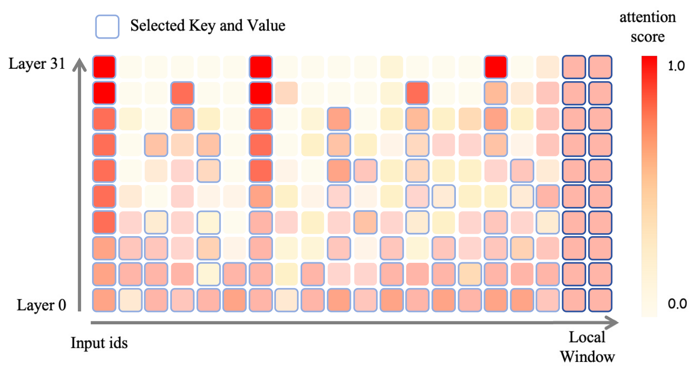

# PyramidKV: Dynamic KV Cache Compression based on Pyramidal Information Funneling

### **Problem Solved**

The paper addresses a critical issue in large language models (LLMs), namely the inefficiency in memory usage caused by traditional Key-Value (KV) caching mechanisms. In current models, KV caches are uniformly allocated across all layers, which results in excessive memory consumption, particularly in the lower layers of the network. This inefficiency becomes more pronounced in large models with long contexts, where memory management plays a significant role in performance and scalability.

### **Challenges**

1. **Inefficient Memory Usage:** The uniform allocation of KV cache across all layers does not take into account the varying importance of attention at different layers in an LLM. This results in an unnecessary memory footprint, particularly in the lower layers, which have broader and less focused attention.
2. **Contextual Information Distribution:** The attention mechanism in LLMs does not exhibit uniform importance across all tokens. Instead, attention spreads widely in lower layers and progressively narrows down to critical tokens in higher layers. Designing a cache compression mechanism that adapts to this uneven distribution of attention and information across layers is challenging.
3. **Performance Trade-Off:** Reducing memory usage by decreasing KV cache size may lead to a trade-off with model performance, particularly for long-context tasks that require extensive memory. Thus, the challenge is to find a method that retains performance while reducing memory consumption.

### **Key Idea and Technique**

**Pyramidal Information Funneling** The authors observe that attention in LLMs is not uniformly distributed across layers. Lower layers exhibit more scattered attention, while higher layers focus on more critical tokens, forming a pyramidal pattern.

To capitalize on this, PyramidKV dynamically adjusts the KV cache size across different layers:

- **Lower layers** (with more dispersed attention) are allocated a larger portion of the KV cache.
- **Higher layers** (which focus on a smaller set of critical tokens) use a smaller portion of the cache.

This dynamic allocation significantly reduces memory usage without compromising model performance.

### **Results**

The authors conducted extensive experiments using the **LongBench benchmark** to evaluate PyramidKV's effectiveness. Their findings demonstrate that:

- PyramidKV can reduce memory usage to just **12%** of the original KV cache size while maintaining the same performance as models using a full KV cache.
- This results in a significant reduction in memory consumption, especially for models with long-context processing, making it highly beneficial for large-scale models where memory management is a major constraint.

PyramidKV's ability to dynamically allocate cache across layers allows it to match the performance of models with full KV caches while vastly improving memory efficiency.

### **Future Work**

While PyramidKV shows promising results, there are several areas for potential future research:

1. **Extension to Other Architectures:** The approach could be generalized beyond transformer-based architectures, including other types of attention-based models or even more general neural network structures.
2. **Optimizing for More Tasks:** Although the paper uses the LongBench benchmark, testing PyramidKV on a broader range of natural language processing (NLP) tasks and benchmarks could provide a deeper understanding of its generalizability and potential limitations.
3. **Adaptive Layer-wise Compression:** Investigating even more granular control over memory allocation, where the cache size could be dynamically adjusted during the course of training or inference, might lead to even further memory savings without sacrificing performance.
4. **Hardware Efficiency:** The paper focuses on reducing memory usage from a theoretical perspective, but real-world implementation would require optimization for specific hardware constraints. Future work could explore how PyramidKV interacts with hardware accelerators (e.g., GPUs or TPUs) and how the memory footprint can be optimized further on these devices.
5. **Exploring Compression Mechanisms for KV Caches:** There might be opportunities to incorporate advanced compression techniques for KV caches to reduce their size even further without significantly impacting the model’s performance.

