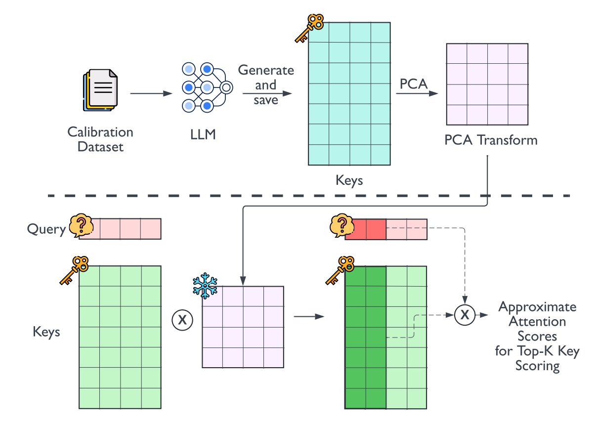

# Loki: Low-Rank Keys for Efficient Sparse Attention

## Overview
The paper addresses the challenge of efficient inference on large language models (LLMs), particularly focusing on the self-attention mechanism, which is computationally and memory-intensive, especially with long sequence lengths. The authors propose Loki, a novel sparse attention method that leverages the intrinsic low-dimensionality of key vectors in the self-attention block to speed up computation while maintaining model efficacy.

## Problems
- **High Computational and Memory Costs**: Inference on LLMs is expensive due to the high computational and memory costs associated with the self-attention mechanism.
- **Scalability Issues**: The KV-cache read/write cost during inference scales quadratically with sequence length, exacerbating the problem as sequences get longer.
- **Model Efficacy vs. Efficiency Trade-off**: Traditional sparse attention methods often sacrifice model quality for efficiency, leading to a trade-off between performance and resource utilization.

## Challenges
- **Maintaining Model Quality**: Developing a sparse attention method that does not significantly compromise the quality of the model's output.
- **Efficient Implementation**: Ensuring that the proposed method can be implemented efficiently to minimize additional data movement and computational overhead.
- **Consistency Across Datasets and Models**: Demonstrating that the method is effective across different datasets and transformer-based models.

## Key Idea and Technique

- **Dimensionality Analysis**: The core insight is that key vectors in the self-attention mechanism lie in a significantly lower-dimensional space than their full dimensionality, which is consistent across various datasets and models.
- **Loki Method**: By performing principal component analysis (PCA) on the key vectors, the authors identify a reduced set of principal components that capture most of the variance. Loki then uses these low-rank keys to compute approximate attention scores, selects the top-k tokens, and computes the final attention scores using only the selected keys, thus reducing both data movement and computational costs.

## Results
- **Performance Improvement**: Loki achieves up to a 40% speedup over base attention for the Llama2-13B model, with an average degradation in model accuracy of only 6.8% points across multiple benchmarks and models.
- **Consistent Performance**: The method maintains model efficacy better than other popular approximation methods, demonstrating its effectiveness across different datasets and models.

## Future Work
- **Further Optimization**: Investigate additional optimizations or modifications to the Loki method to further improve the speedup without compromising model quality.
- **Broader Application**: Explore the application of Loki to other types of neural network architectures beyond transformers where self-attention mechanisms are used.
- **Hardware-Aware Design**: Develop hardware-aware implementations of Loki, taking into account specific GPU or TPU architectures to maximize efficiency.
- **Adaptive Sparsity Patterns**: Investigate dynamic or adaptive sparsity patterns that could adjust the level of sparsity based on the input sequence or task requirements, potentially improving the balance between efficiency and model quality.

