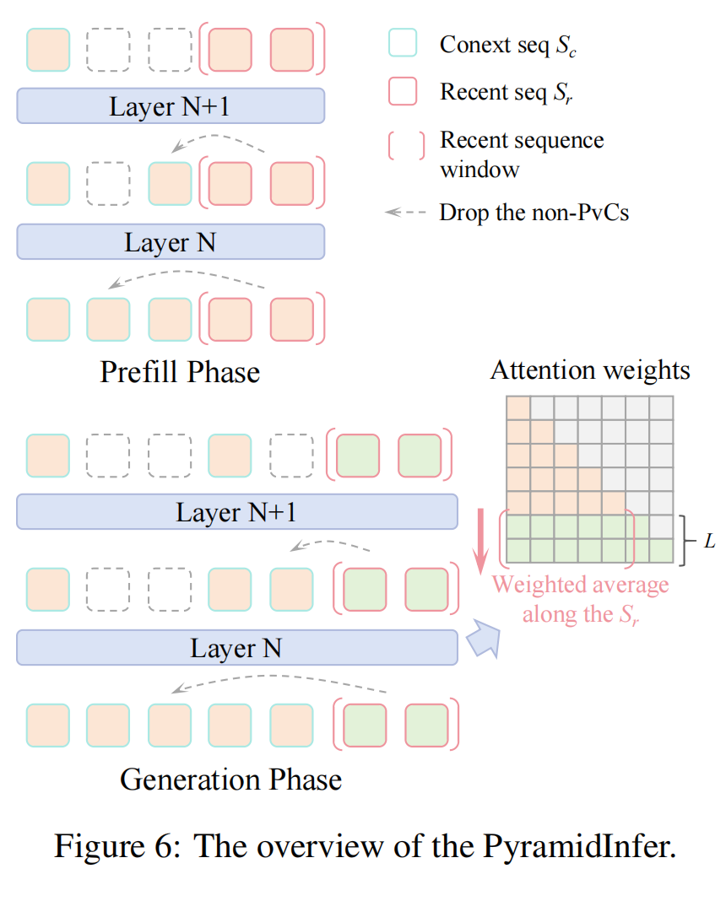

# PyramidInfer: Pyramid KV Cache Compression for High-throughput LLM Inference

## Summary
The paper introduces PyramidInfer, a method designed to address the challenge of high GPU memory usage during the inference phase of large language models (LLMs). By compressing the key-value (KV) cache, PyramidInfer aims to improve the throughput and reduce the memory footprint, thus enabling more scalable deployment of LLMs in real-time applications like chatbots.

## Problems Solved
- **GPU Memory Usage**: During inference, LLMs consume a significant amount of GPU memory, especially due to the storage of pre-computed keys and values (KV cache), which can be several times larger than the model parameters.
- **Scalability**: The high memory consumption hinders the scalability of LLMs, making it difficult to handle thousands of concurrent requests in real-time applications.

## Challenges
- **Inter-layer Dependency**: Existing methods do not consider the inter-layer dependency between layers, leading to suboptimal compression.
- **Pre-computation Overhead**: Methods that compress the KV cache often require pre-computing the entire cache, which itself consumes a lot of memory, particularly for longer prompts and larger models.
- **Maintaining Performance**: Reducing the KV cache must not significantly impact the performance and quality of the generated text.

## Key Idea and Technique

- **Inference Context Redundancy (ICR)**: The authors observe that the number of crucial keys and values that influence future generations decreases layer by layer. They propose to retain only these crucial contexts, which are identified by the consistency in attention weights.
- **Recent Attention Consistency (RAC)**: The authors find that recent tokens closer to the last token have more consistent attention patterns, indicating that they can be used as an oracle to select the important KV cache for future generations.
- **Layer-wise Selection of Pivotal Context (PvC)**: PyramidInfer selects and retains the pivotal context (PvC) at each layer, gradually reducing the length of the KV cache as the layers get deeper, forming a pyramid-like structure.
- **Prefill and Generation Phase Optimization**: Unlike other methods, PyramidInfer is capable of compressing the KV cache in both the prefill and generation phases, ensuring that the initial KV cache is smaller and more efficient.

## Results
- **Memory Reduction**: PyramidInfer reduces over 54% of the GPU memory usage in the KV cache while maintaining or even improving performance.
- **Throughput Improvement**: Compared to full cache methods like Accelerate and Deepspeed, PyramidInfer achieves up to 2.2x higher throughput. It also outperforms other KV cache compression methods like H2O by 2.4x.
- **Quality Preservation**: The method maintains the generation quality across various tasks, including language modeling, benchmarks, conversation, and long context scenarios.

## Future Work
- **Further Optimization**: Explore additional techniques to reduce the computational overhead introduced by the PvC selection process, especially for small batch sizes.
- **Lossless Compression in Prefill Stage**: Develop methods to achieve lossless compression of the KV cache in the prefill stage, which is currently an area not fully explored.
- **Integration with Other Techniques**: Investigate how PyramidInfer can be combined with other non-KV-cache compression methods, such as Deepspeed, to further enhance efficiency.
- **Generalization to Other Models**: Extend the application of PyramidInfer to other types of models and architectures beyond LLMs to see if similar benefits can be achieved.

## Conclusion
PyramidInfer presents a promising solution for optimizing the deployment of LLMs in resource-constrained environments by efficiently compressing the KV cache. The method addresses the critical issue of high GPU memory usage and improves throughput, making it a valuable contribution to the field of LLM inference.