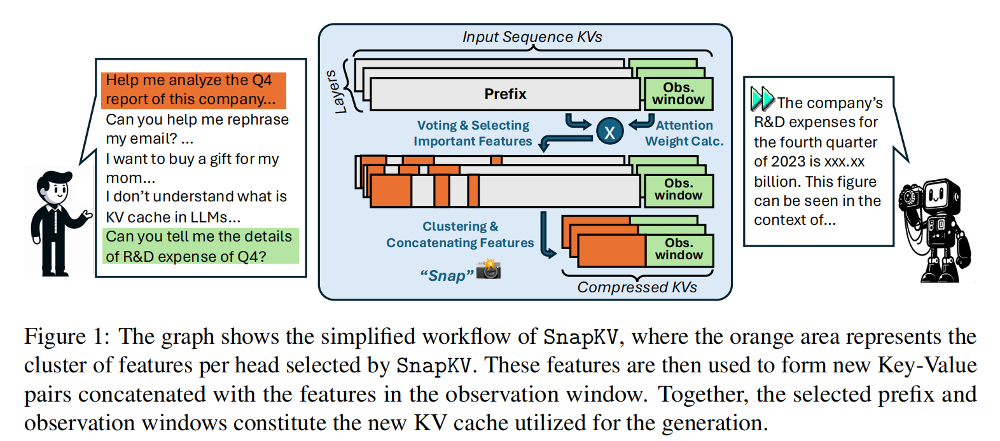

# SnapKV: LLM Knows What You are Looking for Before Generation

## Introduction
The paper introduces SnapKV, a novel and fine-tuning-free approach to efficiently minimize the Key-Value (KV) cache size in Large Language Models (LLMs) while maintaining comparable performance. The method addresses the challenges of memory and time efficiency that arise as the KV cache grows with increasing input length.

## Problems Solved
- **Memory and Time Efficiency**: As the KV cache grows with longer input sequences, it leads to increased computational overhead and memory footprint, which can limit model scalability and increase hardware demands.
- **Inference Latency**: During inference, the decoding latency per step increases linearly with the prompt length due to the attention calculation across past KVs.

## Challenges
- **Complex Attention Allocation Patterns**: Identifying and compressing the KV cache without losing crucial information for accurate generation, especially in scenarios with various noisy contexts.
- **Contextual Understanding**: Compressing the KV cache for prompts, which is often the bottleneck in memory efficiency, without compromising the model's ability to understand complex prompt contexts.

## Key Idea and Technique

- **Observation Window**: SnapKV discovers that each attention head consistently focuses on specific prompt attention features during generation. These robust patterns can be obtained from an 'observation window' located at the end of the prompts.
- **Clustering and Selection**: By clustering and selecting important KV positions for **each attention head**, SnapKV automatically compresses the KV caches. This process involves voting for important previous features and then updating and storing compressed keys and values.
- **Pooling for Clustering**: A pooling layer is used to cluster the selected attention features, ensuring that the surrounding features are retained, thus preserving the contextual integrity.

## Results
- **Decoding Speed and Memory Efficiency**: SnapKV achieves a 3.6x increase in generation speed and an 8.2x enhancement in memory efficiency compared to the baseline when processing inputs of 16K tokens.
- **Performance Consistency**: SnapKV maintains comparable performance to the baseline models across 16 long sequence datasets.
- **Scalability**: SnapKV can process up to 380K context tokens on a single A100-80GB GPU using HuggingFace implementation with minor changes, exhibiting only a negligible accuracy drop in the Needle-in-a-Haystack test.

## Future Work
- **Integration with Other Techniques**: Explore the potential of combining SnapKV with other acceleration strategies such as parallel decoding to further enhance LLM efficiency.
- **Model Adaptation**: Investigate the applicability of SnapKV to different types of LLMs and tasks, including those that require more nuanced understanding of context.
- **Optimization and Customization**: Further optimize the hyperparameters and explore the impact of different pooling techniques (e.g., max pooling vs. average pooling) on the performance.
- **Real-World Applications**: Apply SnapKV to real-world applications, such as chatbots and agents, where long-context understanding is critical, and evaluate its effectiveness in these settings.

