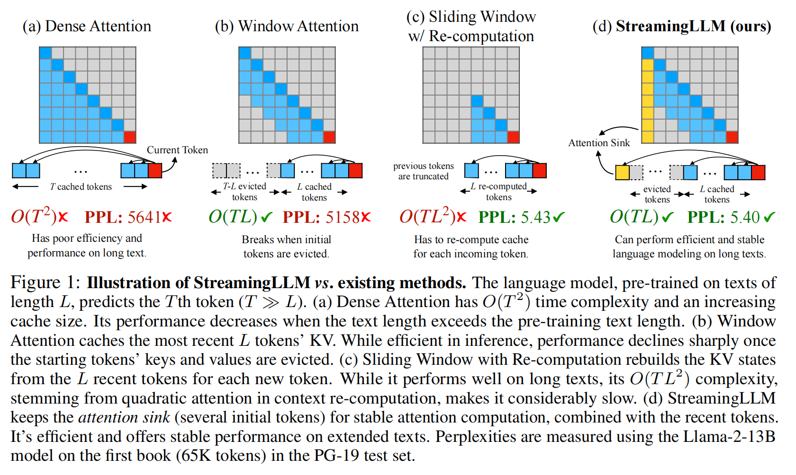

# Efficient Streaming Language Models with Attention Sinks

## Problems Addressed
1. **Memory Usage**: During decoding, caching previous tokens' Key and Value (KV) states consumes extensive memory.
2. **Length Extrapolation**: Popular LLMs cannot generalize well to longer texts than the training sequence length, leading to performance degradation when the text length surpasses the cache size.

## Challenges
1. **Efficiency**: Window attention, which caches only the most recent KV states, fails when the text length exceeds the cache size.
2. **Performance**: Sliding window with re-computation, while performing well on long texts, is significantly slower due to the quadratic attention computation.

## Key Idea and Technique

- **Attention Sinks**: The authors observe that autoregressive LLMs allocate a surprisingly large amount of attention to initial tokens, even if they are not semantically important. These initial tokens act as "attention sinks," collecting significant attention scores.
- **StreamingLLM Framework**: The key technique involves keeping the KV states of a few initial tokens (attention sinks) along with the sliding window's KV to anchor the attention computation and stabilize the model's performance. This approach allows LLMs trained with a finite attention window to generalize to infinite sequence lengths without fine-tuning.
- **Learnable Sink Token**: The authors also propose pre-training LLMs with a dedicated learnable sink token, which can serve as a single attention sink, further improving streaming deployment.

## Results
- **Performance**: StreamingLLM can enable Llama-2, MPT, Falcon, and Pythia to perform stable and efficient language modeling with up to 4 million tokens and more.
- **Efficiency**: Compared to the sliding window with re-computation baseline, StreamingLLM achieves up to a 22.2× speedup.
- **Perplexity**: StreamingLLM demonstrates stable performance, with perplexity nearly matching that of the sliding window with re-computation baseline.
- **Zero-shot Accuracy**: Pre-training with a sink token does not harm the model's convergence and subsequent performance on a range of NLP benchmarks.

## Future Work
1. **Context Utilization**: Enhance the model's ability to fully utilize the provided context, as increasing the cache size does not consistently lower the language modeling perplexity.
2. **Long-term Memory**: Develop techniques to extend the model's context window and enhance its long-term memory capabilities for tasks requiring extensive data dependency.
3. **Generalization**: Further investigate the generalization capabilities of the model to different types of streaming applications and datasets.
4. **Ethical Considerations**: Address potential negative impacts such as misinformation and biased content generation risks with robust ethical guidelines and safeguards.

