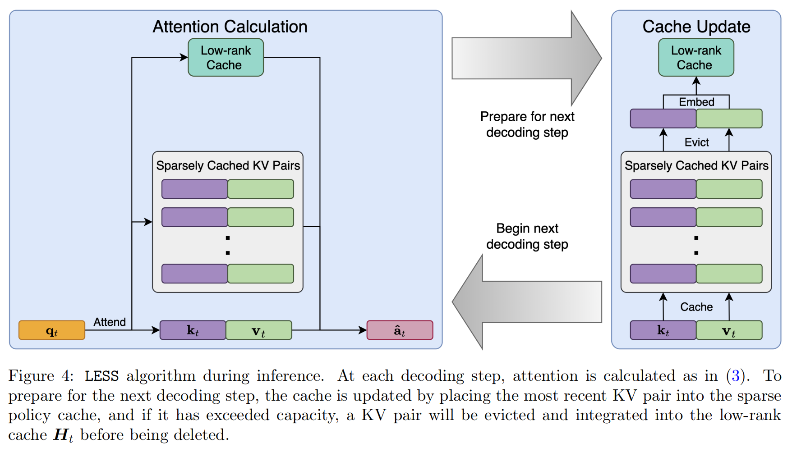

# Get More with LESS: Synthesizing Recurrence with KV Cache Compression for Efficient LLM Inference

## Overview
Get More with LESS addresses the memory bottleneck associated with key-value (KV) caches in large language models (LLMs). The authors propose a method called LESS, which integrates **a low-rank cache** with existing sparse caching policies to improve the efficiency and performance of LLMs during inference. The work is motivated by the need to reduce the computational burden while maintaining the quality of generated text.

## Problems Addressed
- **Memory Bottleneck**: The KV cache, which stores previous keys and values at each layer to avoid recomputing them, can consume more memory than the model itself, especially when generating long sequences or using large batch sizes.
- **Performance Degradation**: Existing methods that prune or evict less important KV pairs to reduce the cache size can lead to significant performance degradation, particularly in tasks that require recollection of a majority of previous tokens.

## Challenges
- **Information Loss**: Sparse policies often discard potentially important tokens, leading to gaps in attention maps and reduced model performance.
- **Efficiency vs. Performance Trade-off**: While storing more tokens can help, it is not memory efficient, and there's a need to balance between memory usage and model performance.
- **Integration Complexity**: New methods should be easy to integrate into pre-trained LLMs without requiring extensive modifications or retraining.

## Key Idea and Technique

- **LESS (Low-rank Embedding Sidekick with Sparse policy)**: This method combines a small, constant-sized **low-rank cache** with **eviction-based sparse caching policies**. The low-rank cache accumulates information that would otherwise be discarded, allowing the model to query and recover previously omitted regions in attention maps.
- **Kernel Functions**: LESS uses kernel functions to **approximate** the residual between the original attention output and the output from a sparse policy. These kernels are trained to minimize the difference, effectively synthesizing the sparse and low-rank structures.
- **Recursive Updates**: Inspired by recurrent networks, the low-rank state updates **recursively**, integrating new information without increasing memory footprint.

## Results
- **Performance Improvement**: LESS significantly reduces the performance gap compared to full caching, sometimes even matching the full cache performance, as demonstrated on various datasets and tasks.
- **Memory Efficiency**: The low-rank cache in LESS occupies a constant amount of memory, making it nearly free in terms of additional storage.
- **Latency and Throughput**: LESS reduces latency by 1.1-1.3x and increases throughput by 1.7x compared to full caching, making it more efficient for real-time applications.
- **Transferability**: LESS shows good transferability across different sparsity levels and sparse policies, indicating its robustness and versatility.

## Future Work
- **Kernel Design**: Further improvements in the design of kernel functions could enhance the approximation accuracy and expressiveness.
- **Residual Analysis**: Investigating the residuals of LESS to better understand the limitations and potential areas for improvement.
- **Scalability**: Extending the method to even larger models and longer sequences to push the boundaries of what is possible with condensed KV caches.
- **Generalization**: Exploring the application of LESS to other domains beyond NLP, such as computer vision and healthcare, where similar memory bottlenecks may exist.

