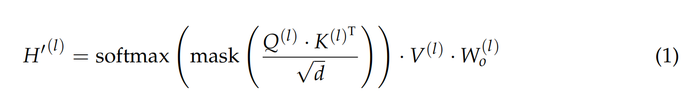
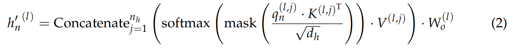

## **Keep the Cost Down: A Review on Methods to Optimize LLM’s KV Cache Consumption**

减少KV缓存的使用，以提高LLMs处理长文本的效率。

### **Preliminary and Notations**

1. **LLM的核心功能**：LLM的主要功能是将一系列整数输入序列（称为tokens）转换为等量的多个概率分布。
2. **符号表示**：
   - **X**：表示输入的整数序列（tokens序列），长度为n，由$x_i$表示第i个token。
   - **V**：表示词汇表，$x_i$是词汇表中的一个元素。
   - **$p_i$**：表示下一个token相对于$x_i$的概率。
   - **PROMPT**：自然语言输入，经过标记化处理转换为输入**X**。
   - **LLM**：将输入**X**转换为$p_i$。
3. **Transformer架构**：
   - Transformer模型由多个解码器层组成，嵌入层和线性层之间存在多个Transformer解码器块。
   - 嵌入层将每个token $x_i$转换为d维向量$h^{(0)}_i$，线性层和softmax将每个d维向量转换为概率分布$p_i$。
4. **Self-Attention机制**：
   - 每个解码器块由**自注意力**（Self-Attention）和**前馈网络**（Feed-Forward Network, FFN）组成。
   - 自注意力部分将$h^{(l)}_i$映射到三个新的向量$q^{(l)}_i$、$k^{(l)}_i$和$v^{(l)}_i$。
   - 
   - **多头注意力（Multi-Head Attention, MHA）**：
     - MHA将q、k、v分割到$n_h$个较小的块（头）中，每个头的维度为$d_h$ = $d/n_h$，分别计算之后再连接起来。
     - 使用掩码（mask）来防止早期token关注到后期的token。
     - 
5. **KV缓存**：
   - KV缓存通过存储由先前token生成的注意力模块中的键和值张量，将生成每个token所需的时间复杂度降低到线性。
   - KV缓存会随着序列长度的增加而线性增加。

### **Training Stage Optimization**

**模型架构调整**：

- 在预训练阶段，模型的可塑性最强，因此可以进行更激进的架构调整。
- 主要的调整是减少生成的键（Keys）和值（Values）向量的大小。

1. **Multi-Query Attention (MQA)**：
   - 即使只保留一个头用于键和值，也能取得满意的模型性能。
   - 不同的query head使用相同的key head计算注意力分数。
2. **Grouped Query Attention (GQA)**：
   - 分组查询注意力（GQA），该方法通过将查询头分成多个组来平衡速度和性能。
   - 每个组共享一个key head，为相应的值头提供不同的组合权重。
   - 通过调整参数$n_g$（组数），可以在效率和性能之间取得更细粒度的平衡。
3. **层间KV缓存重用**：
   - 通过在**层之间共享KV缓存**，可以在保持模型容量的同时减少KV缓存的大小。
   - 一些方法如CLA直接重用这些内容，而其他方法如YOCO和GoldFinch使用线性模型生成所有层的KV cache。
   - **主要的优化空间：内存传输速度，对KV cache的零散访问**
4. **低秩压缩(LoRA)**：
   - 考虑KV缓存重用为低秩压缩的一种形式，**完整低秩压缩**应具有更大的潜力。
   - Multi-Head Latent Attention (MLA)方法，通过使用额外的扩展矩阵来实现KV缓存的解压缩。
   - **主要的优化空间：使用完整低秩压缩，了解完整低秩压缩**
5. **结合编码器的架构**：
   - CEPE框架框架将预训练的LLM与用于压缩上下文的编码器模块结合起来。
   - 在RAG场景中，超长上下文会大大增加存储KV缓存的需求。
   - CEPE的额外编码器压缩这些参考文本，然后通过交叉注意力输入解码器。
   - **优化空间：额外训练开销比较大**

### **Deploy-Stage Optimization (inference)**

**推理系统挑战**：

- KV缓存在推理系统中面临两个主要挑战：**内存分配和释放导致的碎片化**，以及**KV缓存无法批处理**导致的内存带宽瓶颈。

1. **Paged Attention机制 (vLLM)**：
   - 分页注意力（Paged Attention）机制灵感来自CPU内存中广泛使用的分页内存机制。
   - 通过使用额外的映射表，将原本连续存储的KV缓存映射到不连续的GPU内存中。
   - 分页注意力机制使得内存碎片几乎不会产生，并且推理效率得到提升。
2. **DistAttention和DistKV-LLM**：
   - 进一步发展了分页注意力的思想，提出了DistAttention和基于此的DistKV-LLM。
   - KV缓存能够在多台服务器上分布式部署，显著提高了使用大规模云服务器提供LLM服务的效率。
3. **跨对话KV缓存重用**：
   - 通过建立所有历史对话的字典树，在收到新的对话请求时，找到字典树中最长的公共前缀，并重用这部分对应的KV缓存。
   - ChunkAttention使得模型避免了在预填充阶段重复计算某些token，加快了部署系统的响应速度。
   - **主要的优化空间：如何选择重用的缓存，全重用（推理效果差）还是部分重用（部分重计算），如何选择重计算部分（CacheBlend）。**
4. **KV缓存的CPU卸载**：
   - 将KV缓存主要部分卸载到CPU的策略，仅保留关键部分。
   - 通过在GPU上推测性地重新加载少量KV缓存，节省了高速计算设备上的内存空间，同时避免了大量数据交换。
   - **主要的优化空间：选择卸载的选择算法，优化传输速度。**
5. **CPU协作注意力计算**：
   - 通过协作使用CPU进行注意力计算，提高GPU利用率，增强整体有效计算能力，加速推理速度。

### **Post-Training Optimizations**

1. **Eviction**：淘汰策略涉及决定哪些token应该从KV缓存中移除，以便为新的token腾出空间。淘汰可以基于静态策略（如滑动窗口）或动态策略（如基于注意力权重）。

   - **静态策略**：如滑动窗口注意力，保留最近的token。
     - **优化空间：已有工作证明initial tokens比较重要，是否有其他重要性算法**

   - **动态策略**：基于attention weights或其他指标，动态决定哪些token是重要的，哪些可以被淘汰。
     - Repetitive Attention Pattern:之前的重要token在后面的步骤中也会很重要（**新出现的重要token如何判断**）
     - Token Omission Via Attention (TOVA)：在每一步decode过程中逐层驱逐attention weights最低的token。
     - H2 Eviction Algorithm：使用累积的归一化注意力分数来决定token的保留，同时保留最近的token。
     - PyramidInfer：采用逐层方法，为最近的token分配更多权重，逐层分配更低权重给更深层的kv。**（考虑逐层进行量化，但是可能需要特定的cuda核支持不同精度计算）**
     - Keyformer：引入额外方法来平滑注意力分数的不均匀分布。**（量化之后的常用手段，以保证近似对称分布）**
     - SparQ Attention：减少数据传输量，**（具体方法待调研）**。
     - FastGen：混合的淘汰算法。**（具体方法待调研）**
     - **不依赖注意力得分的方法（研究较少）**：token entropy，$L_2$ norm of keys。

2. **Merging**：合并策略将多个token的信息合并到一个token中，以减少KV缓存的需求。

   - **主要优化空间：如何选择合并的范围，合并方式和方案的选择（key或者value）**

   - 基于 attention scores：如Dynamic Memory Compression (DMC)，使用训练后的维度来决定是否合并。

   - 基于高斯权重：KVMerger使用高斯权重和attention scores来合并KV。

   - 将MHA转换为GQA：合并不同attention head的kv cache中的token，需要额外计算。

   - Anchor-LLM：anchor-based self-attention，训练时合并token。**（具体方法待调研）**

3. **量化（Quantization）**：通过将数据从全精度映射到较低精度来减少内存占用。包括对权重，key和value进行量化。
   - KV缓存量化：仅针对KV缓存进行量化，保留模型权重的全精度。
     - Kvquant：量化key和value的激活值。**（具体方法待调研）**
     - LESS：LoRA方法，通过替代softmax函数量化。**（具体方法待调研）**
     - Quality Adaptive Quantization (QAQ)：分别量化key和value。key应该更具有区分度，需要精度更高。**（参考其不同精度如何进行分别计算）**使用attention widow预测未来的attention score，对可能的attention score高的token不量化。
     - GEAR：对key value进行基于LoRA的统一量化，使用残差矩阵修正异常值。**（参考其异常值处理方法）**
   - 全模型量化：包括模型权重和KV缓内的全面量化，优化工作主要在于量化后异常值处理。
     - FlexGen：量化所有数据至4bit。
     - KVQuant：设置阈值忽略异常值。
     - WKVQuant：使用平滑函数重新映射到正常区间内。

### Evaluation

#### 数据集

评估KV缓存优化通常涉及以下类型的数据集：

1. **长文本基准测试**：
   - 评估模型处理极长文本的能力。例如，LongBench、ZeroSCROLLS、L-Eval、BAMBOO、XL2bench、InfiniteBench 和 LooGLE 等。
2. **关键检索**：
   - 测试直接从无关的上下文中提取特定信息的能力，如Needle in a Haystack、Passkey Retrieval 和 RULER。
3. **少样本测试**：
   - 通过扩展传统短文本测试集的长度，或模拟多轮对话，来测试模型处理长文本的能力。

#### 评估指标

1. **每个Token的GPU内存使用**：
   - 直接反映优化方法在减少内存占用方面的有效性。
2. **吞吐量和延迟**：
   - 吞吐量通常以每秒生成的Token数（token/s）来衡量，延迟是指生成每个新Token所需的时间（TTFT）。
3. **困惑度（Perplexity, PPL）**：
   - 衡量模型在给定上下文下预测下一个Token的性能，概率分布的相似度。PPL越低，表示模型的性能越好。

#### 综合考量

在评估KV缓存优化方法时，需要综合考虑以下因素：

1. **效率和性能的平衡**：
   - 优化方法应该在提高效率（如减少内存使用）的同时，最小化对模型性能（如准确性）的影响。
2. **可扩展性**：
   - 优化方法应该能够适应不同的模型大小和复杂性。
3. **实用性**：
   - 优化方法应该易于实现，并且能够在实际应用中产生积极的效果。
4. **泛化能力**：
   - 优化方法不仅在特定数据集上有效，而且能够泛化到其他类型的文本和任务。

### 优化角度

1. 压缩kv，同时不影响计算速度。
2. 压缩和驱逐策略的trade-off。
3. 使用多级存储kv，不影响检索和计算。
4. 高效的kv存储，管理和检索方式。

